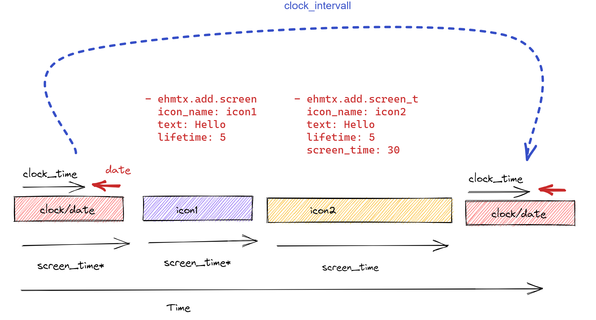
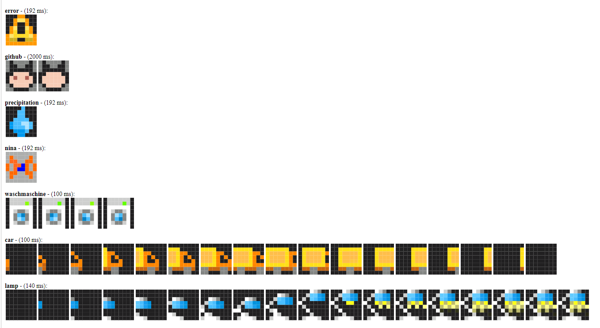
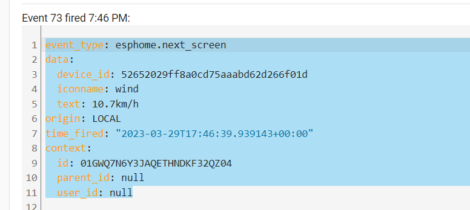
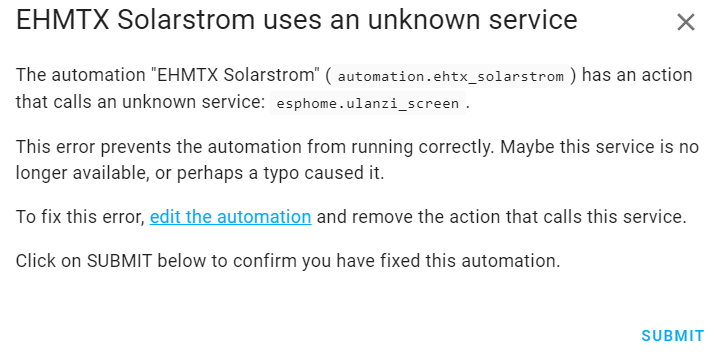
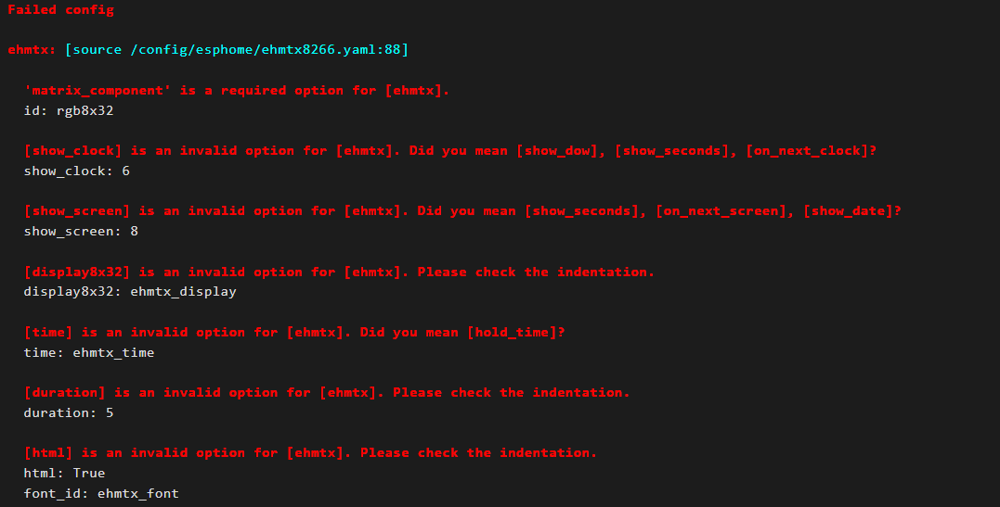

# EspHoMaTriX (ehmtx)

A simple DIY status display, build with a flexible 8x32 RGB LED panel implemented with [esphome.io](https://esphome.io)


## Introduction

There are some "RGB-matrix" status displays/clocks out there, the commercial one from Lametric and some very good DIY-alternatives. 

- [LaMetric](https://lametric.com/en-US/) commercial ~ 199€
- [Ulanzi TC001](https://www.aliexpress.com/item/1005005008682055.html) commercial ~ 50€
- [Awtrix](https://awtrixdocs.blueforcer.de/#/) (project has been discontinued after more than 4 years now in August 2022)
- [PixelIt](https://docs.bastelbunker.de/pixelit/) (project is under active development)
- [Awtrix-Light](https://github.com/Blueforcer/awtrix-light) From the developer of Awtrix, optimized for the Ulanzi TC001 Hardware

The other DIY  solutions have their pros and cons. I tried some and used AwTrix for a long time. But the cons are so big (in my opinion) that I started an esphome.io variant targeted to an optimized Home Assistant integration. The main reason, for me is the Home Assistant integration!

There is a little hype around the Ulanzi TC001 pixel clock. This hardware can be used with **EspHoMaTriX** (with some limitations). You can connect the device and flash it via USB-C. As a starting point you can use the [``UlanziTC001.yaml``](https://github.com/lubeda/EsphoMaTrix/blob/main/UlanziTC001.yaml). Yet the LDR and battery sensor are not perfectly supported. For another use of the hardware see [PixelIT_Ulanzi](https://github.com/aptonline/PixelIt_Ulanzi) or [AWTRIX-LIGHT](https://github.com/Blueforcer/awtrix-light) firmwares.

### ehmtx in the media

See this German tutorial video with information on setting up your display [RGB-LED Status Display für Home Assistant mit ESPHome | ESPHoMaTrix](https://www.youtube.com/watch?v=DTd9vAhet9A).

Another german tutorial video focused at the Ulanzi [Smarte Pixel Clock über Home Assistant steuern - Entitäten / Icons und mehr in der Ulanzi](https://www.youtube.com/watch?v=LgaT0mNbl34)

See this [nice article](https://blakadder.com/esphome-pixel-clock/) about EsphoMaTrix on a Ulanzi TC001 from [blakadder](https://github.com/blakadder).

Short video on Instagram [@blak_adder](https://www.instagram.com/reel/CpYVByRIaSI)
https://www.instagram.com/reel/CpYVByRIaSI

See this english discussions:
[Share your projects](https://community.home-assistant.io/t/esphomatrix-a-simple-clock-status-display/425325)
[ESPHOME](https://community.home-assistant.io/t/a-simple-diy-status-display-with-an-8x32-rgb-led/379051)

Or in german:
[Showroom](https://community.simon42.com/t/8x32-pixel-uhr-mit-homeassistant-anbindung/1076)

### State

It is a working solution with core functionality coded. Advanced features, like automatic brightness control can be done with esphome actions and automations. The possibilities are endless.

### Features

Based a on a 8x32 RGB flexible matrix it displays a clock, the date and up to 24 other 'screens' provided by Home Assistant. Each screen (value/text) can be associated with a 8x8 bit RGB icon or gif animation (see [installation](#installation)). The values/text can be updated or deleted from the display queue. Each screen has a lifetime, if not refreshed in its lifetime, it will disappear. When a screen is active it is displayed so that the text can scroll two times (`scroll_count`) or even longer for `screen_time` seconds.

You can use the [fullfeature.yaml](https://github.com/lubeda/EsphoMaTrix/blob/main/fullfeature.yaml) as sample for an ESP8266. As mentioned you have to edit to your needs. So check font, icons, board and the GPIO pins for your display.

The file [ulanziTC001.yaml](https://github.com/lubeda/EsphoMaTrix/blob/main/ulanziTC001.yaml) uses the functions ehmtx provides, optimized for the Ulanzi Hardware.

See it in action on [YouTube](https://www.youtube.com/watch?v=ZyaFj7ArIdY) (no sound but subtitles).

## Installation

### **EsphoMaTrix** custom component

**EsphoMaTrix** is a custom component, you have to include it in your yaml configuration. To always use the newest features you should use the repo, to use a stable version you copy a working version to your esphome installation.

#### local use

If you download the components-folder from the repo and install it in your esphome you have a stable installation. But if there are new features, you won't see them. If needed customize the yaml to your folder structure.

```yaml
external_components:
   - source:
       type: local
       path: components # e.g. /config/esphome/components
```

#### use from repo

Use the github repo as component. Esphome refreshes the external components "only" once a day, perhaps you have to refresh it manually. In this mode there may be breaking changes, so read the changelog and check to logs while installing the firmware.

```yaml
external_components:
  - source:
      type: git
      url: https://github.com/lubeda/EsphoMaTrix
      ref: main # optional select a special branch or tag
```

### Addressable_light component

The **EsphoMaTrix** component requires a 8x32 pixel addressable_light, it is referenced by the id `matrix_component`.

See the default [options](https://esphome.io/components/display/index.html)

There are some different matrices-types on the market, to adapt them to **EspHoMaTriX** you have to find the proper pixelmapper. If there is garbage on your display try the other `pixel_mapper`. Here are the most common types for flexible 8x32 matrices:

#### Type 1 

under the display tag specify this pixelmapper:

```yaml
display:
  - platform: addressable_light
    .....
    pixel_mapper: |-
      if (x % 2 == 0) {
        return (x * 8) + y;
      }
      return (x * 8) + (7 - y);
    .....
```

#### Type 2 (e.g. Ulanzi TC001)

Under the display tag specify this pixelmapper:

```yaml
display:
  - platform: addressable_light
    .....
    pixel_mapper: |-
      if (y % 2 == 0) {
        return (y * 32) + x;
      }
      return (y * 32) + (31 - x);
    .....
```

You have to configure this `lambda` under the `display:` section to use the **EsphoMaTrix** component 

```yaml
display:
  - platform: addressable_light
    id: ehmtx_display
    .....
    auto_clear_enabled: true
    lambda: |-
      id(rgb8x32)->tick();
      id(rgb8x32)->draw();
```

### Light component

The light component is used by the addressable_light component and referenced by id under `addressable_light_id:`.

To use the light component directly from home assistant add the sample lambdas```on_turn_on``` and ```on_turn_off``` to the light component.

***Sample***

```yaml
light:
  - platform: neopixelbus
    id: ehmtx_light
    ....
    on_turn_on:
      lambda: |-
         id(rgb8x32)->set_enabled(false);
    on_turn_off:
       lambda: |-
         id(rgb8x32)->set_enabled(true);
```

To hide the light component from home assistant use: ` internal: true`

```yaml
light:
  - platform: neopixelbus
    id: ehmtx_light
    internal: true
    ...
```    

### Time component

Since it is a clock you need a time component e.g. [homeassistant](https://esphome.io/components/time/homeassistant.html). It is referenced by its id under `time_component:` The display shows `!t!` until the time source is synchronized and valid.

### Font
Download a small "pixel" TTF-font, i use ["monobit.ttf"](https://www.google.com/search?q=monobit.ttf). You can modify this font with [FontForge](https://fontforge.org/) and added **€** on base of a **E** and so on. Due to copyright I can't provide my modified version :-(. Not all fonts are suitable for this minimalistic display. There are public domain fonts wich work well on the display e.g. [DMDSmall](https://www.pentacom.jp/pentacom/bitfontmaker2/gallery/?id=5993), details on alternative fonts are [here](https://blakadder.com/esphome-pixel-clock/#fonts).

DarkPoet78 is providing special fonts for 8x32 matrices in his [repo](https://github.com/darkpoet78/MatrixClockFonts)

```yaml
font:
  - file: monobit.ttf
    id: EHMTX_font
    size: 16
    glyphs:  |
      !"%()+*=,-_.:°0123456789ABCDEFGHIJKLMNOPQRSTUVWXYZ abcdefghijklmnopqrstuvwxyz€@
```

### Icons and Animations

Download and install all needed icons (.jpg/.png) and animations (.gif) under the `ehmtx:` key. All icons have to be 8x8 or 8x32 pixels in size. If necessary scale them with gimp, check "as animation" for gifs.

You can also specify an URL to directly download the image file. The URLs will only be downloaded once at compile time, so there is no additional traffic on the hosting website.

There are maximum 90 icons possible.

***Sample***

```yaml
emhtx:
  icons: 
    - id: boot 
      file: icons/rocket.gif
      duration: 75     
    - id: temp 
      file: temperature.png
    - id: yoga
      file: icons/yoga-bridge.gif
      pingpong: true
    - id: garage
      file: garage.gif
      duration: 100
    - id: homeassistant
      url: https://github.com/home-assistant/assets/raw/master/logo/logo-small.png      
```

The id of the icons is used later to configure the screens to display. So you should name them wisely. If you like to group icons you should prefix them e.g. with "weather_" (see Service **del_screen**)

The first defined icon will be used as a fallback icon, in case of an error, e.g. if you use a non-existing icon id.

GIFs are limited to 110 frames to limit the used amount of flash space. 

All other solutions provide ready made icons, especially Lametric has a big database of [icons](https://developer.lametric.com/icons). Please check the copyright of the icons you use. The maximum amount of icons is limited to 90 in the code and also by the flash space and the RAM of your board.

See also [icon parameter](#icons)

## Configuration

### ehmtx component

This component is highly customizable.

***Example***

```
ehmtx:
  id: rgb8x32
  time_component: ehmtx_time
  matrix_component: ehmtx_display
  clock_time: 5    # seconds
  screen_time: 8   # seconds
  font_id: ehmtx_font
  show_dow: true   # day of week
  show_date: true  # also show the date
  icons2html: false # generate html with con overview
  brightness: 80 # percent
  time_format: "%H:%M"
  date_format: "%d.%m."
  week_start_monday: true # false equals sunday
  xoffset: 1 
  yoffset: 2
  scroll_count: 2 # scroll long text at least two times
  scroll_interval: 80 # milliseconds
  frame_interval: 192 # milliseconds
```
***Parameters***

**id** (required, ID): Manually specify the ID used for code generation and in service definitions.

**clock_interval** (optional, seconds): show the clock at least each x seconds, (default=60)

**clock_time** (optional, seconds): duration to display the clock after this time the date is display until next "show_screen". If `show_date` is false and `clock_time` > 0 the clock will be display as long as a normal screen! Setting `clock_time` to 0 will not show the clock or date. If there are no screens ind the queue the display will be blank until the next screen is sent.



**screen_time** (optional, seconds): default duration to display a screen or a clock/date sequence, a long text will be scrolled at least `scroll_count` times (default: 10 seconds). This may be overwritten by the add_screen service.

**hold_time** (optional, seconds): extends the display time of the current screen in seconds (default=20). Used in services or automations, see `hold_screen` 

**date_format** (optional, string): formats the date display with [strftime syntax](https://esphome.io/components/time.html?highlight=strftime), defaults `"%d.%m."` (use `"%m.%d."` for the US)

**show_seconds** (optional, boolean): toggle an indicator for seconds while the clock is displayed (default: false)) 

**time_format** (optional, string): formats the date display with [strftime syntax](https://esphome.io/components/time.html?highlight=strftime), defaults `"%H:%M"` (use `"%I:%M%p"` for the US)

**yoffset** (optional, pixel): yoffset the text is aligned BASELINE_LEFT, the baseline defaults to `6` 

**xoffset** (optional, pixel): xoffset the text is aligned BASELINE_LEFT, the left defaults to `1`

**matrix_component** (required, ID): ID of the addressable display

**show_dow** (optional, bool): draw the day of week indicator on the bottom of the clock screen. Disable e.g. if you want larger fonts, defaults to true. 

**show_date** (optional, bool): if true, show the date for `screen_time - clock_time` seconds otherwise only shows the clock for `screen_time` seconds, defaults to true. 

**time_component** (required, ID): ID of the time component. The display shows `!t!` until the time source is valid.

**font** (required, ID): ID of the font component

**week_start_monday** (optional, bool): default monday is first day of week, false => Sunday

**scroll_interval** (optional, ms): the interval in ms to scroll the text (default=80), should be a multiple of the ```update_interval``` from the [display](https://esphome.io/components/display/addressable_light.html) 

**frame_interval** (optional, ms): the interval in ms to display the next animation/icon frame (default = 192), should be a multiple of the ```update_interval``` from the [display](https://esphome.io/components/display/addressable_light.html). Can be overwritten per icon/gif see [icons](#icons-and-animations) parameter `frame_duration`

**icons2html** (optional, boolean): If true, generate the html (_filename_.html) file to show all included icons.  (default = `false`)

***Example output:***


### icons

***Parameters***
See [icon details](#icons-and-animations)

- **frame_duration** (optional, ms): in case of a gif file the component tries to read the default interval for each frame. The default/fallback interval is 192 ms. In case you need to override the default value set the duration per icon.
- **pingpong** (optional, boolean): in case of a gif file you can reverse the frames instead of starting from the first frame.

- **file** (Exlusive, filename): a local filename
- **url** (Exclusive, url): an URL to download the icon
- **lameid** (Exclusive, number): the ID from the lametric icon database

## Control your display

A lot of features are accessible with actions, you can use in your yaml

### Local actions/lambdas

#### Show all icons on your matrix

This code shows all icons once on boot up, depending on the amount of your icons it can take a while to see them all.

```yaml
esphome:
  ....
  on_boot:
    priority: -100
    # ...
    then:
      - lambda: !lambda |-
          id(rgb8x32)->show_all_icons();
```

---

#### Add screen to your display queue

You can add screens locally and display data directly from any local sensor. See this sample:

##### Lambda

Take care that the ```char text[30];``` has enough space to store the formated text. 

```yaml
sensor:
  - platform: bh1750
    id: sensorlx
    ...
    on_value:
      then:
        lambda: |-
          char text[30];
          sprintf(text,"Light: %2.1f lx", id(sensorlx).state);
          // 5 Minutes,each time at least 11 seconds,no alarm
           id(rgb8x32)->add_screen("sun", text, 5,11, false); 
```

##### Action

```yaml
sensor:
  - platform: bh1750
    id: sensorlx
    ...
    on_value:
      then:
        - ehtmx.add.screen
          id: rgb8x32
          icon_name: "sun"
          text: "new data from lux sensor"
          lifetime: 5 # minutes optional
          screen_time: 35 # seconds optional
          alarm: true # optional
```

***Parameters***

- **id** (required, ID): ID of the ehmtx component
- **text** (required, string): the text to display
- **icon_name** (required, string): the name of the icon to display
- **lifetime** (optional, int): the lifetime of the screen in minutes (default=5)
- **screen_time** (optional, int): the display time of a screen per loop in seconds (default=10)
- **alarm** (optional, bool): if alarm set true (default = false)

---

#### Set (alarm/clock/gauge/text/today/weekday) color action

Sets the color of the selected element

##### Lambda set text color

```yaml
  lamda: 
    id(rgb8x32)->set_text_color(200,45,12);
```

##### Action for set text color

You have to use use id of your ehmtx component, e.g. `rgb8x32`

```yaml
     - ehmtx.***.color:
        id: rgb8x32
        red: !lambda return r;
        green: !lambda return g;
        blue: !lambda return b;
```

valid elements:

- `ehmtx.alarm.color:`
- `ehmtx.clock.color:`
- `ehmtx.gauge.color:`
- `ehmtx.text.color:`
- `ehmtx.today.color:`
- `ehmtx.weekday.color:`
- ```red, green, blue```: the color components (`0..255`) *(default = `80`)*

---

#### Set screen color action

Sets the color of the **active** screen in the queue, so it's best to use it directly after add_screen.

##### Lambda for set_screen

```yaml
  lamda: 
    id(rgb8x32)->set_screen_color("sun",200,45,12);
```

##### Action for set_screen

You have to use use id of your ehmtx component, e.g. `rgb8x32`

```yaml
     - ehmtx.screen.color:
        id: rgb8x32
        icon_name: sun
        red: !lambda return r;
        green: !lambda return g;
        blue: !lambda return b;
```

- ```icon_name```: name of the actual icon/screen
- ```red, green, blue```: the color components (`0..255`) _(default = `80`)_

---

##### Show date

You can dynamically enable or disable the display of the date see parameter `show_date`.

```yaml
    - ehmtx.show.date:
        id: rgb8x32
        flag: !lambda return true;
```

##### Show day of week

You can dynamically enable or disable the display of the day of week, see parameter `day_of_week`.

```yaml
    - ehmtx.show.dayofweek:
        id: rgb8x32
        flag: !lambda return true;
```

##### Force screen

Force the selected screen ```icon_name``` to be displayed next. Afterwards the loop is continuing from this screen. e.g. helpfull for alarms. Or after an update of the value/text.

```yaml
    - ehmtx.force.screen:
        id: rgb8x32
        icon_name: !lambda return icon_name;
```

##### Change configuration during runtime

_Configuration variables/functions:_

Experienced programmers can use this public methods:

```c
    void draw_day_of_week();
    void show_all_icons();
    void get_status();
    void skip_screen();
    void hold_screen();
    void set_screen_time(uint16_t t);
    void set_clock_time(uint16_t t);
    void set_hold_time(uint16_t t);
    void set_clock_interval(uint16_t t);
    void set_show_day_of_week(bool b);
    void set_show_seconds(bool b);
    void set_show_date(bool b);
    void set_brightness(int b); // int because of register_service!
    uint8_t get_brightness();
    void add_screen(std::string icon_name, std::string text, int lifetime, int show_time, bool alarm);
    void set_screen_color(std::string icon_name,int r, int g, int b);
    void del_screen(std::string icon_name);
    void set_frame_interval(uint16_t interval);
    void set_scroll_interval(uint16_t interval);
    void set_scroll_count(uint8_t count);
    void set_duration(uint8_t d);
    void set_indicator_off();
    void set_indicator_on(int r, int g, int b);
    void set_gauge_off();
    void set_gauge_value(int v); // valid: 0 - 100 int because of register_service
    void set_gauge_color(int r, int g, int b);
    void set_text_color(int r, int g, int b);
    void set_clock_color(int r, int g, int b);
    void set_today_color(int r, int g, int b);
    void set_weekday_color(int r, int g, int b);
    void set_alarm_color(int r, int g, int b);
    void draw_clock();
    void draw_gauge();
    void set_display_on();
    void set_display_off();
```

***Sample***

You can set values during runtime e.g. for a night mode

```yaml
# sample for ulanzi tc001
binary_sensor:
  - platform: gpio
    pin:
      number: $left_button_pin
      inverted: true
    on_press:
      - logger.log: "Clock on"
      - lambda:
          id(rgb8x32)->set_clock_time(6);
    name: "clock on"
  - platform: gpio
    pin: 
      number: $right_button_pin
      inverted: true
    name: "Clock off"
    on_press:
      - logger.log: "clock off"
      - lambda:
          id(rgb8x32)->set_clock_time(0);
```

### Local trigger

To use the display without homeassistant automations, you may use the [advanced functionality](#change-configuration-during-runtime) with triggers. The triggers can be fired by sensors, time or by the ehmtx component.

#### on_next_screen
There is a trigger available to do some local magic. The trigger ```on_next_screen``` is triggered every time a new screen is displayed (it doesn't trigger on the clock/date display!!). In lambda's you can use two local string variables:

**x** (Name of the icon, std::string): value to use in lambda

**y** (displayed text, std::string): value to use in lambda

See the examples:

##### Write information to esphome log

```yaml
ehmtx:
  ....
  on_next_screen:
    lambda: |-
        ESP_LOGD("TriggerTest","Iconname: %s",x.c_str());
        ESP_LOGI("TriggerTest","Text: %s",y.c_str());
```

##### Change the text color like crazy

```yaml
ehmtx:
  ....
  on_next_screen:
    lambda: |-
      id(rgb8x32)->set_text_color(rand() % 255, rand() % 255, rand() % 255);
```

##### Send an event to Home Assistant

To send data back to home assistant you can use events.

```yaml
ehmtx:
  ....
  on_next_screen:
    - homeassistant.event:
        event: esphome.next_screen
        data_template:
          iconname: !lambda "return x.c_str();"
          text: !lambda "return y.c_str();"
```

***Result***



#### on_next_clock
The trigger ```on_next_clock``` is triggered every time a new clock display circle starts.
See the examples:

##### Change Clock colors like crazy for each clock circle

```yaml
ehmtx:
  ....
  on_next_clock:
    lambda: |-
      id(rgb8x32)->set_clock_color(rand() % 255, rand() % 255, rand() % 255);
      id(rgb8x32)->set_weekday_color(rand() % 255, rand() % 255, rand() % 255);
      id(rgb8x32)->set_today_color(rand() % 255, rand() % 255, rand() % 255);
```

***Example***

```yaml
api:
  services:
    - service: alarm
      variables:
        icon_name: string
        text: string
      then:
        lambda: |-
          id(rgb8x32)->add_screen(icon_name, text, 7,20, true); // 7 minutes lifetime/screen time 20 sec/alarm=true
```

**(D)** Service **brightness**

Sets the overall brightness of the display (`0..255`)

_parameters:_

- ```brightness```: from dark to bright (`0..255`) (default = `80`) as set in the light component by ```color_correct: [30%, 30%, 30%]```

There's an easier way by using a number component:

```yaml
number:
  - platform: template
    name: "LED brightness"
    min_value: 0
    max_value: 255
    step: 1
    lambda: |-
      return id(rgb8x32)->get_brightness();
    set_action:
      lambda: |-
        id(rgb8x32)->set_brightness(x);
```

Service **screen** (defined in yaml)

Queues a screen with an icon/animation and a text. There can only be one text per icon id. If you need to show e.g. an indoor and an outdoor temperature you have to use different icon id's!

You can update the text on the fly. If the screen is displayed and you change the text for the icon, it will start a new lifetime (see ```lifetime```) with the new text.

_parameters:_

- ```icon_name```: The number of the predefined icons (see installation)
- ```text```: The text to be displayed

_definition:_
```yaml
api:
  services:
    - service: screen
      variables:
        icon_name: string
        text: string
      then:
        - lambda: |-
            id(rgb8x32)->add_screen(icon_name,text,5,10,false);
```

Service **alarm** (defined in yaml)

Alarm is like a regular screen but it is displayed two minutes longer and has a red text color and a red marker in the upper right corner.

_parameters:_

- ```icon_name```: The name of the predefined icon id (see installation)
- ```text```: The text to be displayed

_definition:_
```yaml
api:
  services:
    - service: alarm
      variables:
        icon_name: string
        text: string
      then:
        - lambda: |-
            id(rgb8x32)->add_screen(icon_name,text,10,30,true);
            id(rgb8x32)->force_screen(icon_name);
```

**(D)** Service **del_screen**

Removes a screen from the display by icon name. If this screen is actually display while sending this command the screen will be displayed until its "show_screen"-time has ended.

optionally you can suffix a * to the icon name to perform a wildcard delete which will delete all screens beginning with the icon_name specified.

For example if you have multiple icons named weather_sunny, weather_rain & weather_cloudy, you can issue a del_screen weather_* to remove whichever screen is currently in a slot and replace it with a new weather screen.

_parameters:_

- ```icon_name```: Icon `id` defined in the yaml (see installation)

**(D)** Service **indicator_on** / **indicator_off**

Turns indicator on/off

Display a colored corner on all screens and the clock. You can define the color by parameter.

_parameters:_

- ```r``` red in 0..255
- ```g``` green in 0..255
- ```b``` blue in 0..255

**(D)** Service **alarm_color** / **clock_color** / **gauge_color** / **text_color** / **today_color** / **weekday_color**

Set the color of the named text-type

_parameters:_

- ```r``` red in 0..255
- ```g``` green in 0..255
- ```b``` blue in 0..255

**(D)** Service **display_on** / **display_off**

Turns the display on or off

There's an easier way in using a switch component:

***Sample***

```yaml
switch:
  - platform: template
    name: "$devicename Display"
    icon: "mdi:power"
    restore_mode: ALWAYS_ON
    lambda: |-
      return id(rgb8x32)->show_display;
    turn_on_action:
      lambda: |-
        id(rgb8x32)->set_display_on();
    turn_off_action:
      lambda: |-
        id(rgb8x32)->set_display_off();
```

Service **skip_screen**

If there is more than one screen in the queue, skip to the next screen.

e.g. on the Ulanzi TC001

```yaml
binary_sensor:
  - platform: gpio
    pin:
      number: $left_button_pin
      inverted: true
    on_press:
      lambda:
        id(rgb8x32)->skip_screen();
```

Service **hold_screen**

Displays the current screen for configured ammount (see **hold_time**) (default=20) seconds longer.

e.g. on the Ulanzi TC001

```
binary_sensor:
  - platform: gpio
    pin:
      number: $right_button_pin
      inverted: true
    on_press:
      lambda:
        id(rgb8x32)->hold_screen();
```

**(D)** Service **status**

This service displays the running queue and a list of icons in the logs

```log
[13:10:10][I][EHMTX:175]: status status: 1  as: 1
[13:10:10][I][EHMTX:176]: status screen count: 3
[13:10:10][I][EHMTX:181]: status slot: 0 icon: 36  text: 47.9°C end: 400
[13:10:10][I][EHMTX:181]: status slot: 1 icon: 23  text: Supa langer Text end: 310
[13:10:10][I][EHMTX:181]: status slot: 2 icon: 1  text: 10.3°C end: 363
[13:10:10][I][EHMTX:186]: status icon: 0 name: boot
[13:10:10][I][EHMTX:186]: status icon: 1 name: temp
[13:10:10][I][EHMTX:186]: status icon: 2 name: garage
[13:10:10][I][EHMTX:186]: status icon: 3 name: wind
[13:10:10][I][EHMTX:186]: status icon: 4 name: rain
```

**(D)** Service **show_all_icons**

Display all of your icons sequentially by ID.

Service **gauge_value** / **gauge_off**

**(D)** Turns gauge on/off
Displays a colored gauge at the left side of the display. You can define the color by parameter.

_parameters:_

- ```percent``` gauge percentage

## Integration in Home Assistant

To control your display it has to be integrated in Home Assistant. Then it provides a number of services, all prefixed with the configured `devicename` e.g. "ehmtx". See the default services marked as **(D)** [above](#services), but you can add your own (see alarm and screen).

### Services

All communication with Home Assistant use the homeasistant-api. The services can be provided by default or also defined additionally in the yaml. To define the additional services you need the id of the ehmtx-component e.g. ```id(rgb8x32)```.

#### Overview of default services
  
These services are the same as the local services, so you can adapt the documentation there

  |name|parameter|
  |----|----|
  |`get_status`|*none*|
  |`set_display_on`|*none*|
  |`set_display_off`|*none*|
  |`show_all_icons`|*none*|
  |`hold_screen`|*none*|
  |`set_indicator_on`| {"r", "g", "b"}|
  |`set_indicator_off`|*none*|
  |`set_gauge_value`| {"percent"}|
  |`set_gauge_off`|*none*|
  |`set_alarm_color`| {"r", "g", "b"}|
  |`set_text_color` | {"r", "g", "b"}|
  |`set_clock_color`| {"r", "g", "b"}|
  |`set_today_color`| {"r", "g", "b"}|
  |`set_gauge_color`| {"r", "g", "b"}|
  |`set_weekday_color` |{"r", "g", "b"}|
  |`set_screen_color` |{"icon_name","r", "g", "b"}|
  |`add_screen`  |{"icon_name", "text", "lifetime","screen_time", "alarm"}|
  |`force_screen`| {"icon_name"}|
  |`del_screen`| {"icon_name"}|
  |`set_brightness`| {"value"}|

### Use in Home Assistant automations

The easiest way to use ehmtx as a status display is to use the icon names as trigger id. In my example i have an icon named "wind" when the sensor.wind_speed has a new state this automation sends the new data to the screen with the icon named "wind" and so on.

```yaml
alias: EHMTX 8266 Test
description: ''
trigger:
  - platform: numeric_state
    entity_id: sensor.wind_speed
    id: wind
  - platform: state
    entity_id: sensor.actual_temperature
    id: temp
  - platform: state
    entity_id: sensor.wg_cover_device
    id: cover
condition: []
action:
  - service: esphome.ehmtx8266_screen
    data:
      icon_name: '{{trigger.id}}'
      text: >-
        {{trigger.to_state.state}}{{trigger.to_state.attributes.unit_of_measurement}}
mode: queued
max: 10
```

## How to update

Since version **2023.4.0** was a massive cleanup, you may have to check your yaml and your automations for all breaking changes.

### repairs



mostly you have to check your automations if the [service](#overview-of-default-services) definitions have changed

### compile errors


|old name|new name|
|----|----|
|display8x32|matrix_component|
|show_clock|clock_time|
|show_screen|screen_time|
|time|time_component|
|html|icons2html|

---


|old name|new name|
|----|----|
|duration|frame_duration|

---

Old functions in yaml


**old function style**

```yaml
api: 
  services:
    - service: alarm
      variables:
        icon_name: string
        text: string
      then:
        - lambda: |-
            id(rgb8x32)->add_screen(icon_name,text,7,true);
        - ehmtx.force.screen:
            icon_name: !lambda return icon_name;
```
the old `add_screen` function had 4 parameter, the new one has got 5.

**correct code**

```yaml
# Enable Home Assistant API
api: #!include ehmtx_service.yaml
  services:
    .....
      then:
        - lambda: |-
            id(rgb8x32)->add_screen(icon_name,text,7,30,true);
    .....    
```
### old options


Remove these entries.


#### Display precision after home assistant 2023.3.0

See [templating](https://www.home-assistant.io/docs/configuration/templating/#states) for possibilities to optimize the output
e.g.
```{{ states(sensor.solarpower, rounded=True) }} kWh```

### Specific icons per condition

Add an icon per weather condition to the ehmtx component

```yaml
  - id: weather_clear_night
      lameid: 52163
    - id: weather_cloudy
      lameid: 25991
    - id: weather_fog
      lameid: 52167
    ......
```

Sample automation to show the weather with local temperature

```yaml
alias: EHMTX weather
description: weather with icon per condition
trigger:
  - platform: state
    entity_id: weather.metno
action:
  - service: esphome.ulanzi_del_screen
    data:
      icon_name: weather_*
  - service: esphome.ulanzi_screen
    data:
      icon_name: weather_{{ trigger.to_state.state }}
      text: >-
        {{ states("sensor.external_actual_temperature") }}°C
```

or another sample automation for the trashcan type

```yaml
alias: "EHMTX Müllanzeige"
description: Anzeige welche Tonne raus muss. iconnamen gekürzt
trigger:
  - platform: time
    at:
      - "06:30"
      - "08:30"
      - "10:30"
      - "15:00"
      - "17:00"
      - "19:00"
condition:
  - condition: numeric_state
    entity_id: sensor.mulltrigger
    below: "3"
action:
  - service: esphome.ulanzi_del_screen
    data:
      icon_name: trash_*
  - data:
      icon_name: >-
        trash_{{ states("sensor.mulldetails") | replace("Biotonne",   "brow")|
        replace("Papiertonne","blue")| replace("Restmüll",   "grey")|
        replace("gelbe Tonne","yell|") | truncate(4,true,"")  }}     
      text: >-
        {{ states("sensor.mulldetails")|replace(" in","")|replace(" days","
        Tagen") | replace ("0 Tagen","heute") | replace ("1 Tagen","morgen")}}
      duration: 120
    service: esphome.ulanzi_screen
mode: single
```

Prerequisites: This works since 2023.3.1 thanx to @andrew-codechimp for the new del_screen

### Integrate in Home Assistant UI

Add entities to Home Assistant UI for interactive control of your display

#### Brightness

```yaml
number:
  - platform: template
    name: "$devicename brightness"
    min_value: 0
    max_value: 255
    step: 1
    lambda: |-
      return id(rgb8x32)->get_brightness();
    set_action:
      lambda: |-
        id(rgb8x32)->set_brightness(x);
```

#### Display switch

```yaml
switch:
  - platform: template
    name: "$devicename Display"
    icon: "mdi:power"
    restore_mode: ALWAYS_ON
    lambda: |-
      return id(rgb8x32)->show_display;
    turn_on_action:
      lambda: |-
        id(rgb8x32)->set_display_on();
    turn_off_action:
      lambda: |-
        id(rgb8x32)->set_display_off();
```

## Buzzer, sound, buttons and automatic brightness

Awtrix and PixelIt have hardcoded functionality. EHMTX is also capable to build something like that by lambdas. But this is all your freedom.

Example: automatic brightness control with an bh1570 sensor

```yaml
sensor:
  - platform: bh1570
    # ...
    on_value:
      then:
         lambda: |-  
            if (x > 200)
            {
               id(rgb8x32)->set_brightness(50);
            } else {
               id(rgb8x32)->set_brightness(250);
            }
```

## Notifier Custom Component
There is an optional [notifier custom component](https://github.com/lubeda/EHMTX_custom_component) you can install with [HACS](https://hacs.xyz/). It is comparable to the **_screen** service but more streamlined.

## Breaking changes

- 2022.6.1 removed image types only `rgb565` is valid!
- 2023.2.0 removed awtrix icon `awtrixid` support
- 2023.3.5 removed automatic scaling of images and animations
- 2023.3.5 added status,display_on,display_off as default service => remove these from your yaml
- 2023.3.5 added indicator_on/off as default services => remove these from your yaml
- 2023.3.5 added *_color as default services => remove these from your yaml
- 2023.3.5 added show_all_icons,gauge_percent/gauge_off as default services => remove these from your yaml
- 2023.4.0 **cleaner naming** please check all automations and yaml for change naming!!!
- 2023.4.0 removed the select component

## Usage
The integration works with the Home Assistant api so, after boot of the device, it takes a few seconds until the service calls start working.

## Disclaimer

THE SOFTWARE IS PROVIDED "AS IS", use at your own risk!

## Thanks

- **[blakadder](https://github.com/blakadder)** for his contribution (cleanup README.md,fixed sample)
- **[andrew-codechimp](https://github.com/andrew-codechimp)** for his contribution (display on/off & del_screen "*" & show_clock with 0)
- **[jd1](https://github.com/jd1)** for his contributions
- **[aptonline](https://github.com/aptonline)** for his work on the ulanzi hardware
- **[wsbtak](https://github.com/wsbtak)** for the work on the ulanzi hardware
- **[ofirsnb](https://github.com/ofirsnb)** for his contributions
- **[darkpoet78](https://github.com/darkpoet78/MatrixClockFonts)** for his work on optimized fonts
- ** everbody that found bugs/issues and reported them!

## Special thanks to all sponsors
